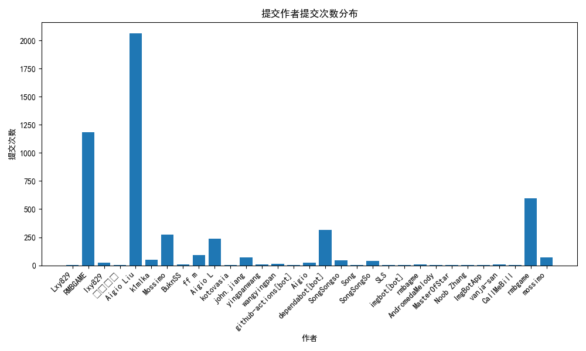
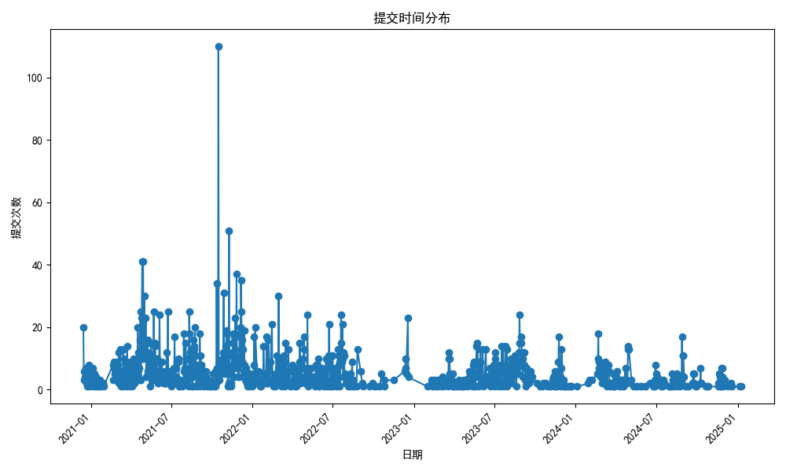

# 针对开源软件 Watt Toolkit 仓库的分析

## 组员信息：

| 学号        | 姓名   | GitHub 用户名   | 角色 |
| ----------- | ------ | --------------- | ---- |
| 20222241379 | 林洋   | Houyi2333       | 组长 |
| 20222241425 | 郭雯欣 | Man1cplus       | 组员 |
| 20222241398 | 李宏伟 | LHW759846       | 组员 |
| 20212241425 | 于栖浩 | littleseven2003 | 组员 |
| 20222241420 | 尹钰晨 | HitoriKoishi    | 组员 |

## Watt Toolkit 介绍

**Watt Toolkit**（原名：Steam++）是一款开源免费、功能强大的多功能工具箱，专为全球玩家设计，旨在提升游戏体验和优化网络环境。作为一款跨平台应用，Watt Toolkit 支持 Windows、macOS 和 Linux，提供了一系列实用功能，涵盖游戏加速、网络优化和工具整合等方面

### 核心功能

1. **网络加速**
   - 支持 Steam、Epic、Origin 等多游戏平台的加速
   - 通过智能路由选择和低延迟服务器，提高游戏下载速度和网络稳定性
   - 自定义规则功能，满足个性化需求
2. **游戏库管理**
   - 集成多游戏平台的游戏库，方便统一管理和启动游戏
   - 支持游戏价格比价功能，帮助用户找到最佳折扣
3. **云服务支持**
   - 提供服务器状态监控功能，实时了解全球服务器运行情况
   - 支持快速切换不同地区的服务器，避免访问受限问题

## Watt Toolkit 整体模块分析

1. **客户端插件模块**：
   - 目录：`src/BD.WTTS.Client.Plugins.Accelerator`
   - 主要文件：
     - `ProxyService`：实现了代理服务的相关逻辑，包括脚本管理、代理服务状态等
2. **发布工具模块**：
   - 目录：`src/BD.WTTS.Client.Tools.Publish`
   - 主要文件：
     - `AppPublishInfo`：管理应用发布信息的模型类
     - `IDotNetPublishCommand`：定义了 .NET 发布命令的接口和相关方法
     - `ObfuscarHelper`：提供了混淆工具 Obfuscar 的辅助方法
3. **IPC 服务模块**：
   - 目录：`src/BD.WTTS.Client/Services.Implementation/IPC`
   - 主要文件：
     - `IPCMainProcessServiceImpl`：实现了主进程的 IPC 服务，包括模块启动、退出和消息写入等功能
4. **资源文件模块**：
   - 目录：`src/BD.WTTS.Client/Resources`
   - 主要文件：
     - `Strings.zh-Hant.resx`：繁体中文的资源文件，包含了界面显示的本地化字符串
     - `Strings.Designer.cs`：自动生成的资源文件访问类
5. **配置文件模块**：
   - 目录：根目录
   - 主要文件：
     - `.gitignore`：Git 忽略文件配置
     - `NuGet.Config`：NuGet 包源配置
     - `.gitmodules`：Git 子模块配置
6. **文档模块**：
   - 目录：doc
   - 主要文件：
     - `file-system.md`：文件系统相关文档
     - `open-source-library.md`：开源库相关文档
7. **解决方案文件**：
   - 目录：根目录
   - 主要文件：
     - `WattToolkit.sln`：Visual Studio 解决方案文件，包含了项目的整体结构和各个子项目的引用

## 提交历史分析

使用 `GitPython` 库来提取提交历史数据，代码位于 `./src/commit_analysis.py`

1. **克隆仓库**：使用 `git.Repo.clone_from` 方法克隆目标 GitHub 仓库

2. **获取提交历史**：通过 `iter_commits` 获取所有提交记录

3. **作者统计**：通过 `Counter` 统计每个作者的提交次数

4. **提交时间统计**：提取提交的时间并绘制提交次数随时间变化的趋势图

5. **可视化**：使用 `matplotlib` 生成两个图表：

   - 提交作者与提交次数的柱状图
   - 提交日期与提交次数的折线图

   图表位于 `./results` 下

6. **数据保存**：提交信息保存于 `./data` 下





可以看出，Aigio Liu 和 RMBGAME 是主要的贡献者，贡献次数远超其他人，其次是一些次要贡献者和少量贡献的其他贡献

提交频率在2021年下半年显著增加，表明该时间段内项目活动较为活跃

## Issue 和 PR 分析

使用 `request` 库与 `GithubAPI`来提取提交历史数据，代码位于 `./src/issue_pr_get.py`

1. **构建请求 URL**：将 GITHUB_API_URL、REPO_OWNER、REPO_NAME拼接到 GitHub API 的 issues 接口 URL 中。
2. **发送 GET 请求**：调用 `requests.get` 方法，向 GitHub API 发送 GET 请求获取 Issue 信息。
3. **处理响应结果**：
   - **请求成功（状态码 200）**：解析响应的 JSON 数据，并将相关信息存储到 issues_data 列表中。
   - **请求失败**：打印无法获取 Issue 信息及对应的错误状态码。
4. **保存数据**：将 issues_data 列表以 JSON 格式写入 `./data/issue_info.json` 文件

通过 `issue_pr_analysis.py` 可读取 `./data/issue_info.json` 文件计算问题解决率，平均解决时间，作者问题解决率和高质量作者率

结果如下：

```shell
问题解决率: 53.84%
平均解决时间: 1157.87 小时
高质量作者比例: 66.45%
```

## 代码静态分析

使用 `Roslyn` 框架对代码进行静态分析，相关实现代码位于 `./src/static_analysis.py` 文件中。该过程旨在评估 C# 代码的质量，识别潜在问题并生成详细的分析报告。

> - **Roslyn**：这是一个开源的 .NET 编译平台，提供了丰富的 API，用于代码分析和编译。通过自定义分析器，开发者能够创建特定的规则来检查代码质量。

1. **编写C#分析器**：分析器对应的C#项目目录为 `./src/static_analysis_cs` 。使用 `.NET8.0` 进行编译。分析器通过一下流程进行对代码的诊断分析：
   1. 初始化分析器：通过 `Initialize` 方法，分析器注册了对方法声明的分析。每当遇到方法声明时，都会触发 `AnalyzeNode` 方法对其进行具体分析。
   2. 检查未处理的异常：在 `AnalyzeNode` 方法中，分析器会检查方法体内是否存在 `catch` 子句。如果没有，它将报告一个诊断信息，提示该方法可能抛出未处理的异常。
2. **使用Python脚本调用分析器**：通过遍历 `Watt Toolkit` 源代码的所有 `.cs` 文件，并调用上述编译的C#分析器，分析包括检查未处理的异常及其他潜在的代码问题。
3. **结果保存**：对于每个模块中的 `.cs` 文件，生成一个分析后的结果文件，保存在 `./results/static_analysis/{模块名}` 中。
4. **报告生成**：对于每个模块，将该模块中生成的所有 `.results` 文件内容汇总为一个PDF报告，保存在 `./results/static_analysis` 中。同时汇总所有分析结果，生成最终的代码静态分析报告，位置为 `./results/static_analysis_report.pdf`。

以下列出部分分析结果：

```
Results for XmlnsDefinitionAttribute.cs:
     (9,48): error CS0246: 未能找到类型或命名空间名“Attribute”(是否缺少 using 指令或程序集引用?)
     (8,2): error CS0246: 未能找到类型或命名空间名“AttributeUsageAttribute”(是否缺少 using 指令或程序集引用?)
     (8,2): error CS0246: 未能找到类型或命名空间名“AttributeUsage”(是否缺少 using 指令或程序集引用?)
     (8,17): error CS0103: 当前上下文中不存在名称“AttributeTargets”
     error CS5001: 程序不包含适合于入口点的静态 "Main" 方法
Results for DrawingContextExtensions.cs:
     (1,16): error CS0234: 命名空间“Avalonia”中不存在类型或命名空间名“Media”(是否缺少程序集引用?)
     (2,16): error CS0234: 命名空间“Avalonia”中不存在类型或命名空间名“Media”(是否缺少程序集引用?)
     (3,16): error CS0234: 命名空间“Avalonia”中不存在类型或命名空间名“Platform”(是否缺少程序集引用?)
     (9,41): error CS0246: 未能找到类型或命名空间名“DrawingContext”(是否缺少 using 指令或程序集引用?)
     (9,65): error CS0246: 未能找到类型或命名空间名“Bitmap”(是否缺少 using 指令或程序集引用?)
...
```

## 模糊测试实现